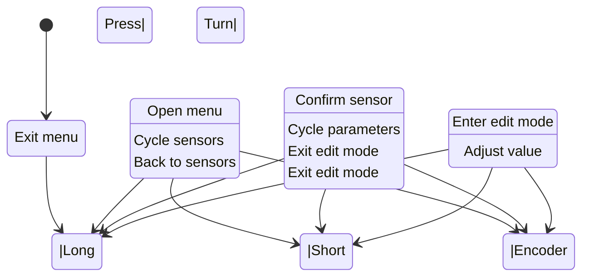

# ConfigMenu Flow Diagram

## State Machine Overview



## Detailed Flow - Normal Usage

```
┌──────────────────────────────────────────────────────────────────────┐
│ CLOSED STATE (Normal MIDI streaming)                                 │
│ - Encoder sends MIDI CC                                              │
│ - Switch sends MIDI CC                                               │
│ - MIDI output enabled                                                │
└──────────────────────────────────────────────────────────────────────┘
                    ↓ [LONG PRESS menu button]
┌──────────────────────────────────────────────────────────────────────┐
│ SELECT_SENSOR STATE                                                  │
│ - Print: "[MENU] sensor: EncoderSensor (1/2)"                        │
│ - MIDI output PAUSED                                                 │
│ - Encoder selects sensor (wraps around)                              │
└──────────────────────────────────────────────────────────────────────┘
        ↙ [LONG PRESS]      ↓ [SHORT PRESS]      ↘ [ENCODER TURN]
      CLOSED              SELECT_PARAM         SELECT_SENSOR
                                                 (next sensor)
                                
┌──────────────────────────────────────────────────────────────────────┐
│ SELECT_PARAM STATE                                                   │
│ - Print: "[MENU] EncoderSensor.midi_channel = 10 [select]"          │
│ - Encoder selects parameter (wraps around)                           │
│ - Shows current value read-only                                      │
└──────────────────────────────────────────────────────────────────────┘
        ↙ [LONG PRESS]      ↓ [SHORT PRESS]      ↘ [ENCODER TURN]
    SELECT_SENSOR          EDIT_PARAM           SELECT_PARAM
                                               (next parameter)

┌──────────────────────────────────────────────────────────────────────┐
│ EDIT_PARAM STATE                                                     │
│ - Print: "[MENU] EncoderSensor.midi_channel = 10 [edit]"            │
│ - Encoder adjusts value within [minValue, maxValue] with step size  │
│ - Value changes immediately                                          │
│ - Sensor receives new parameter value in real-time                   │
└──────────────────────────────────────────────────────────────────────┘
        ↙ [LONG PRESS]      ↓ [SHORT PRESS]      ↘ [ENCODER TURN]
    SELECT_PARAM           SELECT_PARAM         EDIT_PARAM
    (exit edit)            (exit edit)          (adjust value ±step)
```

## Parameter Examples by Sensor Type

### EncoderSensor Parameters
| Name | Min | Max | Step |
|------|-----|-----|------|
| midi_channel | 0 | 15 | 1 |
| midi_control | 0 | 127 | 1 |
| min | 0 | 127 | 1 |
| max | 0 | 127 | 1 |
| sensitivity | 1 | 16 | 1 |

### ToggleSwitchSensor Parameters
| Name | Min | Max | Step |
|------|-----|-----|------|
| midi_channel | 0 | 15 | 1 |
| midi_control | 0 | 127 | 1 |
| value_off | 0 | 127 | 1 |
| value_on | 0 | 127 | 1 |
| debounce_ms | 5 | 500 | 5 |

### PotentiometerSensor Parameters
| Name | Min | Max | Step |
|------|-----|-----|------|
| midi_channel | 0 | 15 | 1 |
| midi_control | 0 | 127 | 1 |
| analog_min | 0 | 1023 | 1 |
| analog_max | 0 | 1023 | 1 |
| midi_min | 0 | 127 | 1 |
| midi_max | 0 | 127 | 1 |
| threshold | 1 | 16 | 1 |

### UltrasonicSensor Parameters
| Name | Min | Max | Step |
|------|-----|-----|------|
| midi_channel | 0 | 15 | 1 |
| midi_control | 0 | 127 | 1 |
| dist_min_cm | 1 | 400 | 1 |
| dist_max_cm | 1 | 400 | 1 |
| midi_min | 0 | 127 | 1 |
| midi_max | 0 | 127 | 1 |
| sample_ms | 10 | 500 | 5 |
| threshold | 1 | 16 | 1 |

## Input Mapping During Menu

| State | Input | Action | Result |
|-------|-------|--------|--------|
| **Closed** | Long Press | Open | → SelectSensor |
| | Short Press | (ignored) | (no change) |
| | Encoder | Send MIDI CC | (normal) |
| **SelectSensor** | Long Press | Exit | → Closed |
| | Short Press | Confirm | → SelectParam |
| | Encoder ↑ | Next sensor | Cycle forward |
| | Encoder ↓ | Prev sensor | Cycle backward |
| **SelectParam** | Long Press | Back | → SelectSensor |
| | Short Press | Confirm | → EditParam |
| | Encoder ↑ | Next param | Cycle forward |
| | Encoder ↓ | Prev param | Cycle backward |
| **EditParam** | Long Press | Back | → SelectParam |
| | Short Press | Back | → SelectParam |
| | Encoder ↑ | Increase | value += step |
| | Encoder ↓ | Decrease | value -= step |

## MIDI Streaming Control

```
┌─────────────────────────────────────────┐
│ Mode: Closed                             │
│ sensorManager.setEnabled(true)           │
│ → MIDI CC messages flowing               │
└─────────────────────────────────────────┘

               ↓ [Long Press]

┌─────────────────────────────────────────┐
│ Mode: SelectSensor | SelectParam | EditParam
│ sensorManager.setEnabled(false)          │
│ → MIDI streaming PAUSED                 │
│ → Encoder & switch input held             │
└─────────────────────────────────────────┘

               ↓ [Exit]

┌─────────────────────────────────────────┐
│ Mode: Closed                             │
│ sensorManager.setEnabled(true)           │
│ → MIDI CC messages resume                │
└─────────────────────────────────────────┘
```
